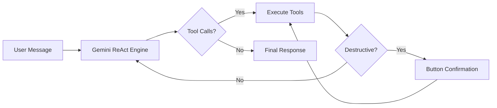

# 🤖 Agentic Discord Admin Bot

Manage your Discord server through natural language - powered by Google Gemini's ReAct agentic loop.

An autonomous admin bot that reasons about your requests, chains tool calls together, and executes multi-step workflows without hand-holding. Tell it what you want in plain English and it figures out the rest.


---

## ✨ Features

- 🧠 **ReAct Agentic Loop** — Multi-step reasoning with automatic tool chaining
- 🔧 **38 Admin Tools** — Channel management, moderation, roles, invites, emojis, messaging, and more
- 🤖 **Autonomous Workflows** — Chains actions independently (e.g. "delete all channels with 'bingo' in the name" → lists → filters → deletes each one)
- 🔒 **Human-in-the-Loop** — Destructive actions show interactive ✅ Approve / ❌ Reject buttons
- 👑 **Admin-Only Access** — Only users with the Administrator permission can issue commands
- 🔄 **Automatic Retry** — 429 rate-limit errors from Gemini are retried with exponential backoff
- 💬 **Conversation Memory** — Full conversation history preserved across messages
- 📋 **Daily Alert Summaries** — Midnight scheduled task that summarises the day's alerts via LLM
- 🗄️ **SQLite Database** — Persistent storage for system alerts and user warnings

---

## 🎥 Demo

https://github.com/user-attachments/assets/Agentic-Discord-Admin-Showcase.mp4

<video src="assets/Agentic Discord Admin Showcase.mp4" controls width="100%"></video>

---

## 🎬 How It Works



1. An admin sends a natural language message in the designated channel
2. The **Gemini ReAct engine** reasons about what tools to use
3. Tools are executed — destructive actions require **button confirmation**
4. Tool results are fed back to Gemini for further reasoning or a final response
5. The bot posts the result to the channel

---

## 📦 Setup

### Prerequisites

- Python 3.10+
- [Discord Bot](https://discord.com/developers/applications) with all Privileged Intents enabled
- [Google Gemini API Key](https://aistudio.google.com/apikey)

### Installation

```bash
git clone https://github.com/BenBrady96/agentic-discord-admin.git
cd agentic-discord-admin

python -m venv venv
venv\Scripts\activate     # Windows
source venv/bin/activate  # Linux/Mac

pip install -r requirements.txt

cp .env.example .env
# Edit .env with your credentials
```

### Running

```bash
python bot.py
```

---

## ⚙️ Configuration

### Environment Variables

| Variable | Required | Description |
|---|---|---|
| `DISCORD_TOKEN` | ✅ | Bot token from the Developer Portal |
| `GEMINI_API_KEY` | ✅ | Google Gemini API key |
| `ADMIN_CHANNEL_ID` | ✅ | Channel ID the bot listens to |
| `GUILD_ID` | ✅ | Your server ID |
| `GEMINI_MODEL` | ❌ | Model name (default: `gemini-2.5-flash`) |
| `DB_PATH` | ❌ | SQLite file path (default: `admin_bot.db`) |

> **Tip:** Enable **Developer Mode** in Discord (Settings → Advanced), then right-click any channel, server, or user → **Copy ID**.

### Discord Bot Setup

#### Privileged Intents

Enable all three on the **Bot** tab in the Developer Portal:

- ✅ **Presence Intent** — member online/offline status
- ✅ **Server Members Intent** — fetching member lists and roles
- ✅ **Message Content Intent** — reading messages in the admin channel

> ⚠️ **The bot will not work without these intents enabled.**

#### Bot Permissions

Invite with **Administrator** permission (simplest), or select granular permissions: Manage Channels, Manage Roles, Ban Members, Kick Members, Manage Messages, Manage Server, Create Instant Invite.

Use **OAuth2 → URL Generator** with the `bot` scope to generate your invite link.

#### Role Hierarchy

> ⚠️ **Critical!** Bots can only manage roles **below** their own role.

Drag the bot's role above any roles you want it to manage:

```
👑 Server Owner
🔒 Your Admin Role
🤖 Bot Role          ← drag ABOVE roles to manage
───────────────
🎮 Gamer Role        ← bot CAN manage
🆕 New Member Role   ← bot CAN manage
@everyone
```

---

## 💬 Usage

Send natural language commands in your admin channel (requires **Administrator** permission):

| Command | What happens |
|---|---|
| *"What channels do we have?"* | Lists all channels |
| *"Show me info about user 123456789"* | Fetches user details |
| *"Ban user 987654321 for spamming"* | Shows ✅/❌ buttons, then bans |
| *"Delete all channels with 'bingo' in the name"* | Lists → filters → deletes each match |
| *"Remove all roles from @user"* | Fetches user → removes each role |
| *"Create a text channel called announcements"* | Creates the channel |
| *"Lock the #general channel"* | Prevents sending messages |

The bot chains multiple tool calls autonomously — no need to break tasks into individual steps.

---

## 🔒 Security

- **Admin-only access** — Non-admin users are rejected with a visible warning
- **Admin channel only** — Ignores all other channels and DMs
- **Button confirmation** — 12 destructive actions require ✅/❌ (buttons auto-remove after use)
- **Rate limiting** — Per-tool cooldowns prevent Discord API abuse
- **Tool call caps** — Max 25 tool calls per message, 25 loop iterations
- **Gemini retry** — 429 errors retried automatically with backoff (up to 3 attempts)

---

## 🏗️ Project Structure

```
agentic-discord-admin/
├── bot.py                      # Entry point — events, admin guard, scheduler
├── requirements.txt
├── .env.example
├── .gitignore
├── LICENSE
└── src/
    ├── config.py               # Environment variables and constants
    ├── database.py             # Async SQLite layer (aiosqlite)
    ├── rate_limiter.py         # Per-tool cooldown enforcement
    ├── agent/
    │   ├── events.py           # Data classes (ConfirmationRequest, etc.)
    │   └── llm_client.py       # Gemini ReAct engine
    └── tools/
        ├── schemas.py          # Gemini function declarations
        ├── registry.py         # Central tool name → function mapping
        ├── helpers.py          # Shared Discord object resolvers
        ├── info.py             # 13 read-only information tools
        ├── messaging.py        # Send/edit/pin messages, threads
        ├── channels.py         # Channel & category CRUD
        ├── moderation.py       # Ban, kick, timeout, purge, warn
        ├── roles.py            # Role CRUD & assignment
        ├── server.py           # Server settings (slowmode, topic, lock)
        ├── invites.py          # Invite management
        ├── emoji.py            # Custom emoji CRUD
        └── alerts.py           # Database alert tools
```

---

## 📄 License

MIT — see [LICENSE](LICENSE) for details.

---

## 📧 Contact

**BenBrady96** — [GitHub](https://github.com/BenBrady96)
